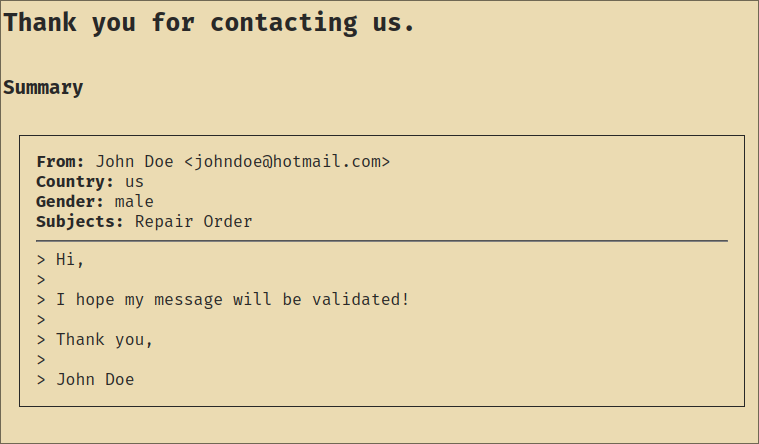

# hackers_poulette
## Introduction




## Try it!
I hosted the website on https://www.pythonanywhere.com/\
You can try it [here](http://jeanmadao.pythonanywhere.com/)!

## Input validation
### Name validation
```
^[a-zA-Z]+(-[a-zA-Z])*$
```
For the name, I check that the string only contains alphabet letters,
and I also allow the `-` character in case the name is in multiple
parts (like Jean-Pierre).

### Email validation
```
^\w+@\w+.[a-z]{2,}$
```
For email, I check that the local-part is only constituted of at least one
character, followed by the `@` char, then same thing for the domain part,
then the `.`, and then I check that the TLD is at least 2 lower letters.

### Country validation
```
^(be|fr|de|nl|us)$
```
For the country, I only check for 5 countries. Obviously, there are a little
bit more than 5 countries in the world, but for this project, this is okay.

## Handling of XSS and SSTI
There is not much to do here. According to the docs `Flask configures Jinja2
to automatically escape all values unless explicitly told otherwise`. This is 
usually not enough, but for this simple project, there shouldn't be any other
XSS/SSTI vulnerabities to exploit here.

## Roadmap

### Required
- [x] Working flask website
- [x] Working Form
- [x] Input validator
- [x] Input sanitization
- [x] Form confirmation

### Optional
- [x] Install HTMX
- [ ] Actually ***USE*** HTMX
